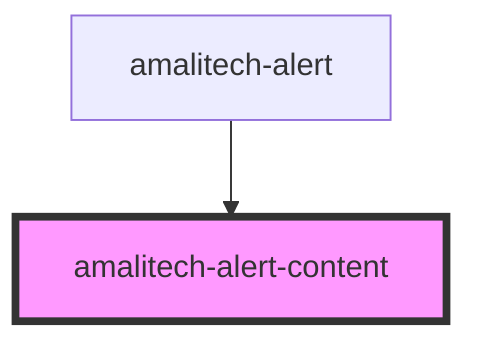

# amalitech-alert-content

<!-- Auto Generated Below -->

## Properties

| Property       | Attribute       | Description                               | Type                                          | Default     |
| -------------- | --------------- | ----------------------------------------- | --------------------------------------------- | ----------- |
| `actionLabel`  | `action-label`  |                                           | `string`                                      | `'Dismiss'` |
| `actionName`   | `action-name`   |                                           | `string`                                      | `'dismiss'` |
| `actionable`   | `actionable`    |                                           | `boolean`                                     | `true`      |
| `dismissible`  | `dismissible`   | renders a close button to close the alert | `boolean`                                     | `false`     |
| `highContrast` | `high-contrast` | enables the high contrast color scheme    | `boolean`                                     | `false`     |
| `state`        | `state`         | type of alert to be shown                 | `"error" \| "info" \| "success" \| "warning"` | `'info'`    |

## Events

| Event                         | Description         | Type               |
| ----------------------------- | ------------------- | ------------------ |
| `alert:alert-content-dismiss` | dismiss alert event | `CustomEvent<any>` |

## Dependencies

### Used by

 - [amalitech-alert](../amalitech-alert)

### Graph

----------------------------------------------

*Built with [StencilJS](https://stenciljs.com/)*
