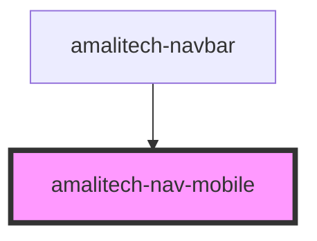

# amalitech-nav-mobile

<!-- Auto Generated Below -->

## Properties

| Property | Attribute | Description                                                           | Type                | Default   |
| -------- | --------- | --------------------------------------------------------------------- | ------------------- | --------- |
| `align`  | `align`   | The alignment of the mobile dropdown trigger icon. Defaults to `left` | `"left" \| "right"` | `'right'` |

## CSS Custom Properties

| Name                      | Description                          |
| ------------------------- | ------------------------------------ |
| `--nav-dropdown-bg-color` | The background color of the dropdown |
| `--nav-menu-close-color`  | The color of the close icon          |
| `--nav-menu-icon-color`   | The color of the menu icon           |

## Dependencies

### Used by

 - [amalitech-navbar](../amalitech-navbar)

### Graph

----------------------------------------------

*Built with [StencilJS](https://stenciljs.com/)*
