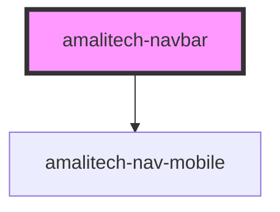

# amalitech-navbar

<!-- Auto Generated Below -->

## Overview

This navbar component is designed to be used with child `amalitech-nav-item` components.

## Properties

| Property          | Attribute           | Description                                                            | Type                                                          | Default              |
| ----------------- | ------------------- | ---------------------------------------------------------------------- | ------------------------------------------------------------- | -------------------- |
| `layout`          | `layout`            | The layout of the navbar. Defaults to `1` aka: "logo \| nav \| search" | `"nav-items-center" \| "nav-items-left" \| "nav-items-right"` | `'nav-items-center'` |
| `mobileIconAlign` | `mobile-icon-align` | The alignment of the mobile dropdown trigger icon. Defaults to `right` | `"left" \| "right"`                                           | `'right'`            |

## Slots

| Slot       | Description            |
| ---------- | ---------------------- |
| `"logo"`   | The logo of the navbar |
| `"search"` | The search bar         |

## CSS Custom Properties

| Name                | Description                                     |
| ------------------- | ----------------------------------------------- |
| `--nav-bg-color`    | The background color of the navbar              |
| `--nav-font-family` | The font size of the nav item                   |
| `--nav-item-gap`    | The space between nav-item elements when active |

## Dependencies

### Depends on

- [amalitech-nav-mobile](../amalitech-nav-mobile)

### Graph

----------------------------------------------

*Built with [StencilJS](https://stenciljs.com/)*
