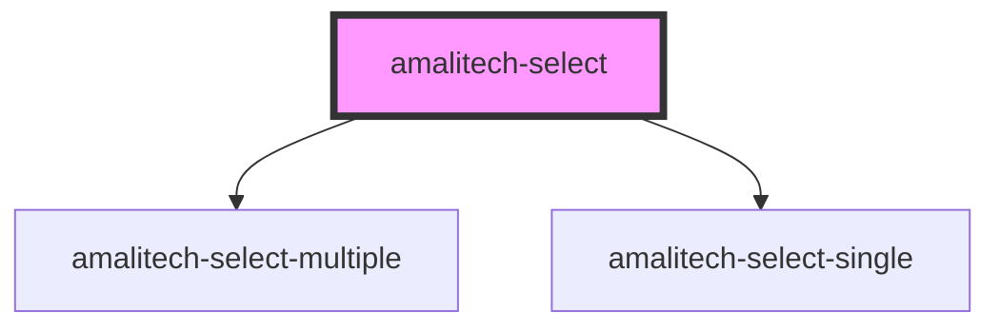

# amalitech-select

<!-- Auto Generated Below -->

## Overview

The Select component is a custom element designed to be used with child select-option elements.

## Properties

| Property        | Attribute        | Description                                                              | Type                                     | Default       |
| --------------- | ---------------- | ------------------------------------------------------------------------ | ---------------------------------------- | ------------- |
| `disabled`      | `disabled`       | If true, the user cannot interact with the select component.             | `boolean`                                | `false`       |
| `label`         | `label`          | The label of the select component eg: 'Select a fruit' or 'Select a car' | `string`                                 | `undefined`   |
| `multiple`      | `multiple`       | If true, the user can select multiple options at once.                   | `boolean`                                | `false`       |
| `open`          | `open`           | Toggles the open state of the dropdown                                   | `boolean`                                | `false`       |
| `required`      | `required`       | If true, the select component will be required                           | `boolean`                                | `undefined`   |
| `scrollable`    | `scrollable`     | If true, the dropdown will be scrollable                                 | `boolean`                                | `undefined`   |
| `selectedStyle` | `selected-style` | The style to be applied when items are checked                           | `"checkRounded" \| "checkmark" \| "dot"` | `'checkmark'` |

## Events

| Event             | Description                                                                                    | Type                                                |
| ----------------- | ---------------------------------------------------------------------------------------------- | --------------------------------------------------- |
| `amalitechChange` | This event emmits the value of the selected option or an array of values if option is multiple | `CustomEvent<{ [x: string]: string \| string[]; }>` |

## Methods

### `clear() => Promise<void>`

This method clears all selected options

#### Returns

Type: `Promise<void>`

## Slots

| Slot | Description                                                         |
| ---- | ------------------------------------------------------------------- |
|      | This defualt slot is deignated for use with select-option elements. |

## CSS Custom Properties

| Name                             | Description                                                                                |
| -------------------------------- | ------------------------------------------------------------------------------------------ |
| `--select-dropdown-border-color` | The border color of the select dropdown default is `$neutral-500`                          |
| `--select-dropdown-border-width` | The border width of the select dropdown default is `1px`                                   |
| `--select-dropdown-height`       | The height of the select dropdown, useful when the select is scrollable default is `10rem` |
| `--select-dropdown-padding`      | The padding of the select dropdown default is `0.35rem`                                    |
| `--select-dropdown-radius`       | The border radius of the select dropdown default is `0.35rem`                              |
| `--select-font-family`           | The font family of the select default is `--amalitech-font-family-sans`                    |
| `--select-label-border-color`    | The border color of the select label default is `$neutral-500`                             |
| `--select-label-border-width`    | The border width of the select label default is `1px`                                      |
| `--select-label-color`           | The color of the select label default is `--amalitech-color-dark`                          |
| `--select-label-font-size`       | The font size of the select label default is `0.875rem`                                    |
| `--select-label-gap`             | The gap between the select label default is `1rem`                                         |
| `--select-label-padding`         | The padding of the select label default is `0.5rem 0.75rem`                                |
| `--select-label-radius`          | The border radius of the select label default is `0.35rem`                                 |
| `--select-label-weight`          | The font weight of the select label default is `500`                                       |
| `--select-width`                 | The width of the select default is `174px`                                                 |

## Dependencies

### Depends on

- [amalitech-select-multiple](../amalitech-select[multiple])
- [amalitech-select-single](../amalitech-select[single])

### Graph

----------------------------------------------

*Built with [StencilJS](https://stenciljs.com/)*
