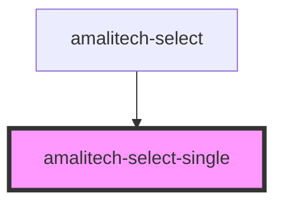

# amalitech-select-single

<!-- Auto Generated Below -->

## Properties

| Property     | Attribute    | Description                                                              | Type                     | Default     |
| ------------ | ------------ | ------------------------------------------------------------------------ | ------------------------ | ----------- |
| `disabled`   | `disabled`   | If true, the user cannot interact with the select component.             | `boolean`                | `undefined` |
| `label`      | `label`      | The label of the select component eg: 'Select a fruit' or 'Select a car' | `string`                 | `undefined` |
| `open`       | `open`       | Toggles the open state of the dropdown                                   | `boolean`                | `false`     |
| `required`   | `required`   | If true, the select component will be required                           | `boolean`                | `undefined` |
| `scrollable` | `scrollable` | If true, the dropdown will be scrollable                                 | `boolean`                | `undefined` |
| `state`      | `state`      | The state of the select component eg: 'single' or 'multiple'             | `"multiple" \| "single"` | `'single'`  |

## Dependencies

### Used by

 - [amalitech-select](../amalitech-select)

### Graph

----------------------------------------------

*Built with [StencilJS](https://stenciljs.com/)*
