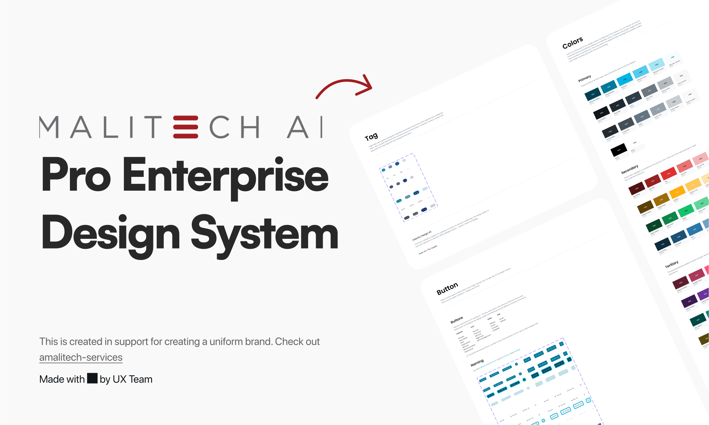

<div align="center"><a name="readme-top"></a>


<h1>Amalitech Design System</h1>

###### An enterprise-class UI design system. Out-of-the-box UI solution for enterprise applications. A design system with values of Nature and Determinacy for better user experience of enterprise applications.</h6>

[![Built With Stencil](https://img.shields.io/badge/-Built%20With%20Stencil-16161d.svg?logo=data%3Aimage%2Fsvg%2Bxml%3Bbase64%2CPD94bWwgdmVyc2lvbj0iMS4wIiBlbmNvZGluZz0idXRmLTgiPz4KPCEtLSBHZW5lcmF0b3I6IEFkb2JlIElsbHVzdHJhdG9yIDE5LjIuMSwgU1ZHIEV4cG9ydCBQbHVnLUluIC4gU1ZHIFZlcnNpb246IDYuMDAgQnVpbGQgMCkgIC0tPgo8c3ZnIHZlcnNpb249IjEuMSIgaWQ9IkxheWVyXzEiIHhtbG5zPSJodHRwOi8vd3d3LnczLm9yZy8yMDAwL3N2ZyIgeG1sbnM6eGxpbms9Imh0dHA6Ly93d3cudzMub3JnLzE5OTkveGxpbmsiIHg9IjBweCIgeT0iMHB4IgoJIHZpZXdCb3g9IjAgMCA1MTIgNTEyIiBzdHlsZT0iZW5hYmxlLWJhY2tncm91bmQ6bmV3IDAgMCA1MTIgNTEyOyIgeG1sOnNwYWNlPSJwcmVzZXJ2ZSI%2BCjxzdHlsZSB0eXBlPSJ0ZXh0L2NzcyI%2BCgkuc3Qwe2ZpbGw6I0ZGRkZGRjt9Cjwvc3R5bGU%2BCjxwYXRoIGNsYXNzPSJzdDAiIGQ9Ik00MjQuNywzNzMuOWMwLDM3LjYtNTUuMSw2OC42LTkyLjcsNjguNkgxODAuNGMtMzcuOSwwLTkyLjctMzAuNy05Mi43LTY4LjZ2LTMuNmgzMzYuOVYzNzMuOXoiLz4KPHBhdGggY2xhc3M9InN0MCIgZD0iTTQyNC43LDI5Mi4xSDE4MC40Yy0zNy42LDAtOTIuNy0zMS05Mi43LTY4LjZ2LTMuNkgzMzJjMzcuNiwwLDkyLjcsMzEsOTIuNyw2OC42VjI5Mi4xeiIvPgo8cGF0aCBjbGFzcz0ic3QwIiBkPSJNNDI0LjcsMTQxLjdIODcuN3YtMy42YzAtMzcuNiw1NC44LTY4LjYsOTIuNy02OC42SDMzMmMzNy45LDAsOTIuNywzMC43LDkyLjcsNjguNlYxNDEuN3oiLz4KPC9zdmc%2BCg%3D%3D&colorA=16161d&style=for-the-badge)](https://stenciljs.com)

Built to work seamlessly with these technologies:

&nbsp;&nbsp;&nbsp;&nbsp;&nbsp;&nbsp;&nbsp;&nbsp;
&nbsp;&nbsp;&nbsp;&nbsp;&nbsp;&nbsp;&nbsp;&nbsp;
&nbsp;&nbsp;&nbsp;&nbsp;&nbsp;&nbsp;&nbsp;&nbsp;
&nbsp;&nbsp;&nbsp;&nbsp;&nbsp;&nbsp;&nbsp;&nbsp;&nbsp;
&nbsp;&nbsp;&nbsp;&nbsp;&nbsp;&nbsp;&nbsp;&nbsp;&nbsp;


</div>


<br>

## ✨ Features

- 🌈 Enterprise-class UI designed for web applications.
- 📦 A set of high-quality components out of the box.
- 🛠️️ Built to work with frontend technologies like React, Vue and Angular.
- 🛡 Written in TypeScript with predictable static types.
- ⚙️ Whole package of design resources and development tools.

## 🖥 Environment Support

- Modern browsers

| [](http://godban.github.io/browsers-support-badges/)<br>Edge | [](http://godban.github.io/browsers-support-badges/)<br>Firefox | [](http://godban.github.io/browsers-support-badges/)<br>Chrome | [](http://godban.github.io/browsers-support-badges/)<br>Safari |     |
| ---------------------------------------------------------------------------------------------------------------------------------------------------------------------------------------------------- | ---------------------------------------------------------------------------------------------------------------------------------------------------------------------------------------------------------------- | ------------------------------------------------------------------------------------------------------------------------------------------------------------------------------------------------------------ | ------------------------------------------------------------------------------------------------------------------------------------------------------------------------------------------------------------ | --- |

<br/>

## 📦 Install a package

Here is a list of the packages available in this repository:

| Package name                             | Description                                                              |
| ---------------------------------------- | ------------------------------------------------------------------------ |
| `@amalitech-design-system/core`           | The Core component package for the Amalitech Design System               |
| `@amalitech-design-system/angular`   | The Angular wrapper components for the Amalitech Design System.          |
| `@amalitech-design-system/design-tokens`           | A package with ADS design language for designers and developers          |
| `@amalitech-design-system/utilities` | A package with a set of utility classes similar to tailwindCSS/Bootstrap |

<br/>

You can install any of these packages using npm or yarn.

<br/>

```bash
npm install @amalitech-design-system/<package-name>
```

```bash
yarn add @amalitech-design-system/<package-name>
```

```bash
pnpm add @amalitech-design-system/<package-name>
```

## 🔨 Usage

```tsx
import { defineCustomElements } from "wrapper-package-name/loader";

defineCustomElements(window);

// with Vanilla JS
<amalitech-button></amalitech-button>;
```

For more on usage, visit [Storybook Documentation](https://amalitech-design-system.amalitech-dev.net)

## 🔗 Links

-   [Home page](https://amalitech-design-system.amalitech-dev.net/)
-   [Components Overview](https://amalitech-design-system.amalitech-dev.net/?path=/docs/components-accordion--usage)

## ⌨️ Development

Clone locally:

```bash
$ git clone https://github.com/Amali-Tech/Amalitech-Design-System.git
$ cd Amalitech-Design-System
$ npm install
$ lerna run dev
```
> [!NOTE]
> After cloning, modify the `manager-head.html` and `preview-head.html` files in `packages/storybook/.storybook` by removing the following lines to eliminate the 
vite import warnings, however this config is neccessary in production and must be
> replaced before running `$ build-storybook`:

```html
<!--manager-head.html-->
<script type="module" src="./assets/amalitech-design-system.esm.js"></script>
<script nomodule src="./assets/amalitech-design-system.js"></script>

<!--preview-head.html-->
<script type="module" src="./assets/amalitech-design-system.esm.js"></script>
<script nomodule src="./assets/amalitech-design-system.js"></script>
```

Open your browser and visit http://localhost:6006

> [!NOTE]
> You might also want to use the local version of the loader custom elements during development phase and switch back to the design system package during production phase.

```ts
/* DEVELOPMENT */
//packages/storybook/.storybook/preview.ts
import docJson from "../../core/doc/docs.json";
import { defineCustomElements, applyPolyfills } from "../../core/loader";
import "../../core/src/global/variables.css";
import { StencilJsonDocs } from "@pxtrn/storybook-addon-docs-stencil/dist/types";

if (docJson) setStencilDocJson(docJson as unknown as StencilJsonDocs);
applyPolyfills().then(() => defineCustomElements(window));
```

```ts
/* PRODUCTION */
//packages/storybook/.storybook/preview.ts
import docJson from "@amalitech-design-system/core/doc/docs.json";
import {
  defineCustomElements,
  applyPolyfills,
} from "@amalitech-design-system/core/loader";
import "@amalitech-design-system/core/src/global/variables.css";
import { StencilJsonDocs } from "@pxtrn/storybook-addon-docs-stencil/dist/types";

if (docJson) setStencilDocJson(docJson as unknown as StencilJsonDocs);
applyPolyfills().then(() => defineCustomElements(window));
```

## 🛠️ Built by

<p align="left">
<a href="https://github.com/seth-amt"></a>
<a href="https://github.com/samackah"></a>
</p>
